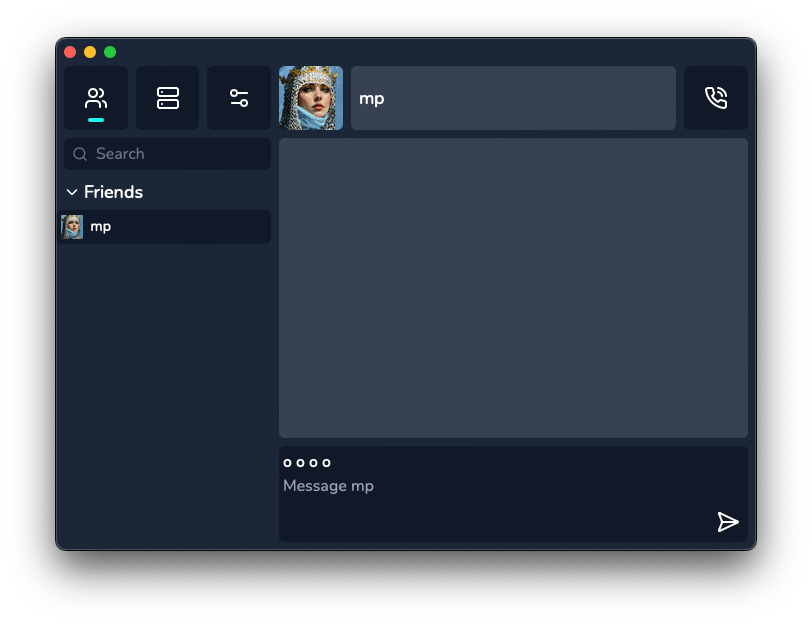

# sept/ʂɛpt/
[](https://goreportcard.com/report/github.com/piheta/sept) [](https://opensource.org/licenses/BSD-3-Clause)
## decentralized, asynchronous p2p chat

sept is a video/chat application similar to discord with no central server. The clients connect directly to eachother making the connection faster than similar applications. Other limitations such as file upload limit are also non existent. 
sept is inspired by various projects, such as hamachi and the old skype p2p infrastructure.



## features
- **private & encrypted:** all messages and files are encrypted and  stored on your device. Sept can't see anything
- **no upload limits:** share terrabytes of files for free. No need to upload them
- **fast:** faster than other chat and communication programs because of its p2p nature
- **better video quality:** your streams are directly being sent to your peers, no server will throttle your performance


## prequisites
you need a [sept login server](https://github.com/piheta/sept-login-server)

## build

 ```sh
  git clone https://github.com/piheta/sept.git
  wails dev
  ```
  
## license
sept is released under the [GPL v3 License](LICENSE).

## c++ poc
check out the legacy multicast [implementation of sept](https://github.com/piheta/sept/tree/legacy)
