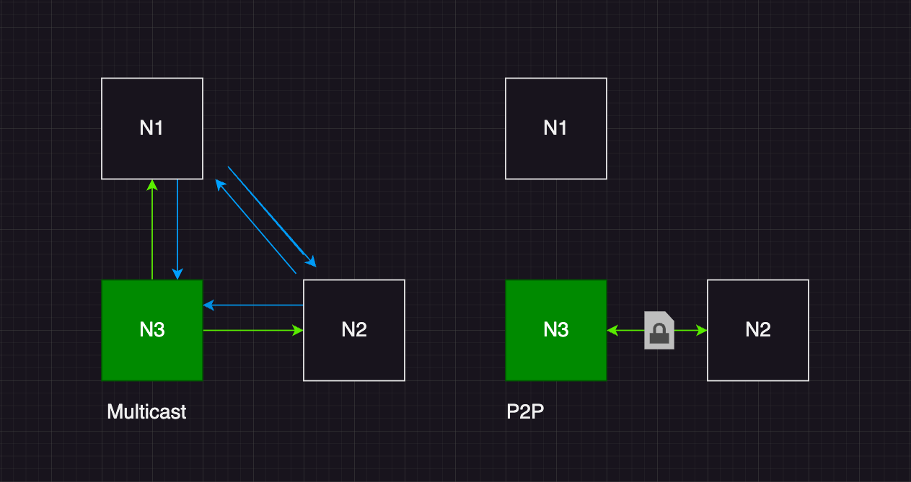

# sept/ʂɛpt/
## decentralized, synchronous p2p chat

sept uses udp multicast to discover and connect with peers within the same network.
when a connection is established between two or more nodes in the network, the communication is encrypted.



## features
- **decentralized:** operates in p2p fashion, eliminating the need for a central server
- **lightweight:** no external libraries are used 
- **thread safe:** multiplexes the io and runs synchronously
- **secure:** data is encrypted in the application layer


sept uses the unix socket.h library for network communication, and is thus currently only supported on Linux and macOS.
## installation

 ```sh
  git clone https://github.com/piheta/sept.git
  cd sept
  make
  make clean
  ./sept
  ```
  
## license
sept is released under the [GPL v3 License](LICENSE).
